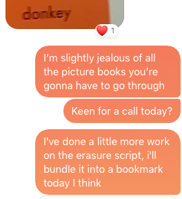
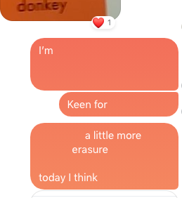

<h1 class="erase-me">Erase</h1>

Erase is a bookmarklet for creating erasure poetry out of online texts.

It was made with f*cebook mess*nger in mind, it works okay with any chunk of text.
Anything that's not plain text might break - If something breaks, or you erase too far, just refresh the page to return everything to it's initial state.

  Visit <a href="https://yesthisislouis.com/erase">the webpage</a> to install the bookmarklet

<h2 class="erase-me">Why?</h2>
<quote>
  life is much, much more than is necessary, and much, much more than any of us can bear, so we erase it or it erases us,
  we ourselves are an erasure of everything we have forgotten or don't know or haven't experienced, and on our deathbed,
  even that limited and erased "whole" becomes further diminished, if you are lucky you will remember the one word water, all others
  have been erased; if you are lucky you will remember one place or one person, but no one will ever, ever read on their deathbed,
  the whole text, intact and in order. - from <em>On Erasure</em> by <a href="http://www.maryruefle.com/">Mary Rueler</a>
</quote>
<h2 class="erase-me">Here it is in the wild</h2>

  
  

<h2 class="erase-me">Thanks to</h2>
<ul class="list pl0">
  <li><a class="link" href="https://www.heralindsaybird.com">Hera Lindsay Bird</a>, for the erasure workshop she hosted in 2015, where I came across the essay from the extract above.</li>
  <li><a class="link" href="https://hellothisismywebsite.com/">Harry Lee Shang Lun</a>,  for getting me on board with a similar project which inspired this bookmarklet.</li>
  <li><a class="link" href="https://gilesgraham.xyz">Giles Graham</a>, for encouragement and helping me test - having his messages subjected to numerous ablations.</li>
  <li><a class="link" href="https://mkremins.github.io/">Max Kreminski</a> for making <a href="https://mkremins.github.io/blackout/">blackout</a> - another inspiration.</li>
</ul>
<footer>
  
developed by <a href="https://yesthisislouis.com">Louis</a> for fun
</footer>
